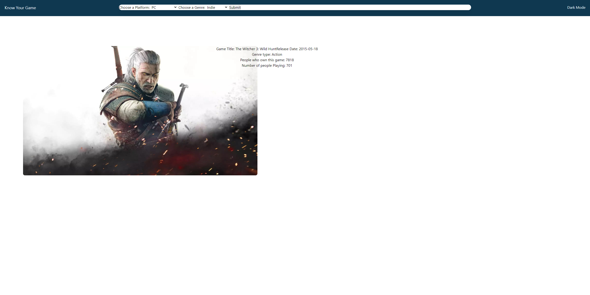
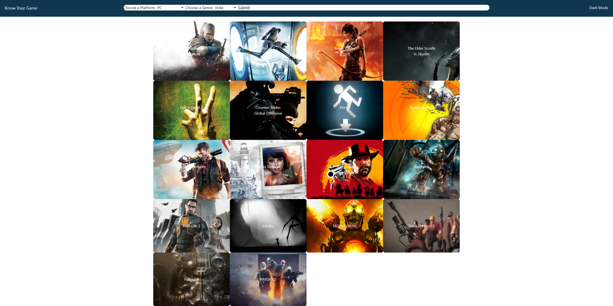

# project1
## Description

- What was our motivation? Ever wonder how many people have the game you are playing? How about how many people are playing it right now? What about if there is a book related to the video game you love to play so much? Well that was the motivation for this application. 
- Why did we build this project? We built this project to better search for games we like to play by genre and platform. Plus the added bonus of knowing whether or not a book has been made about the game. 
- What problem does it solve? This page allows users to find games based on genre and platform, also if your the type that likes to read alot it will tell you if your favorite game has a book that you could check out from your local library. 
- What did we learn? Taking on this project we learned alot about how a page should be formatted, how to use a different framework other than bootstrap and how to work collectively as a team to accomplish the task at hand. 
## Installation
- Attached is a link to the deployed page for easy access. https://aidanrich.github.io/project1/
- Github repo located here https://github.com/aidanrich/project1
## Usage

- To utilize this website follow the following directions:
1. On the landing page if you see a title you like simply click on the title and it will populate the game Title, Date it was released, Genre type, How many people own the game, and Number of people playing the game. 
2. From the drop down selectors at the top choose a platform and a genre and hit search.

3. Once the screen populates your new games. You can click on a title and it will show you the game Title, Date it was released, Genre type, How many people own the game, and Number of people playing the game.
   
## Credits
- We utilized the RAWG api and the Open Library api.
- This was a group project between the following collaborators: Isaac Long, Aidan Rich, Aaron Donelson.
- Special Shout out to Isaac for tackling the tailwind framework and making this page look amazing.

## Badges

## License
- MIT License

Copyright (c) [2021] [Aidan Rich, Isaac Long, Aaron Donelson]

Permission is hereby granted, free of charge, to any person obtaining a copy of this software and associated documentation files (the "Software"), to deal in the Software without restriction, including without limitation the rights to use, copy, modify, merge, publish, distribute, sublicense, and/or sell copies of the Software, and to permit persons to whom the Software is furnished to do so, subject to the following conditions:

The above copyright notice and this permission notice shall be included in all copies or substantial portions of the Software.

THE SOFTWARE IS PROVIDED "AS IS", WITHOUT WARRANTY OF ANY KIND, EXPRESS OR IMPLIED, INCLUDING BUT NOT LIMITED TO THE WARRANTIES OF MERCHANTABILITY, FITNESS FOR A PARTICULAR PURPOSE AND NONINFRINGEMENT. IN NO EVENT SHALL THE AUTHORS OR COPYRIGHT HOLDERS BE LIABLE FOR ANY CLAIM, DAMAGES OR OTHER LIABILITY, WHETHER IN AN ACTION OF CONTRACT, TORT OR OTHERWISE, ARISING FROM, OUT OF OR IN CONNECTION WITH THE SOFTWARE OR THE USE OR OTHER DEALINGS IN THE SOFTWARE.
